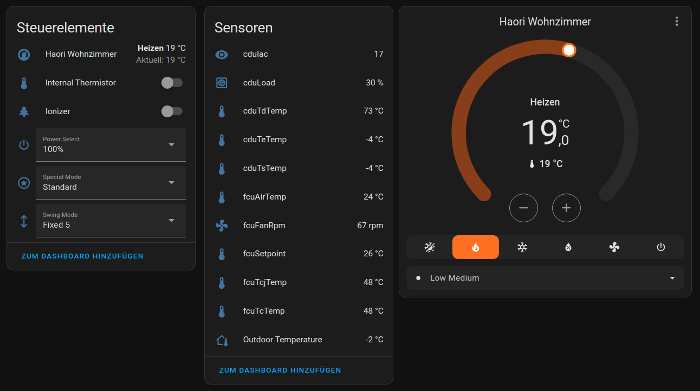
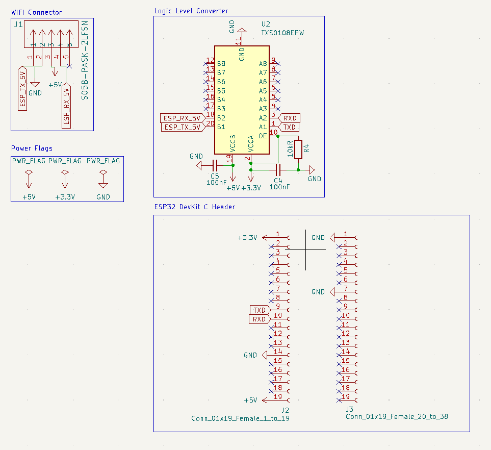
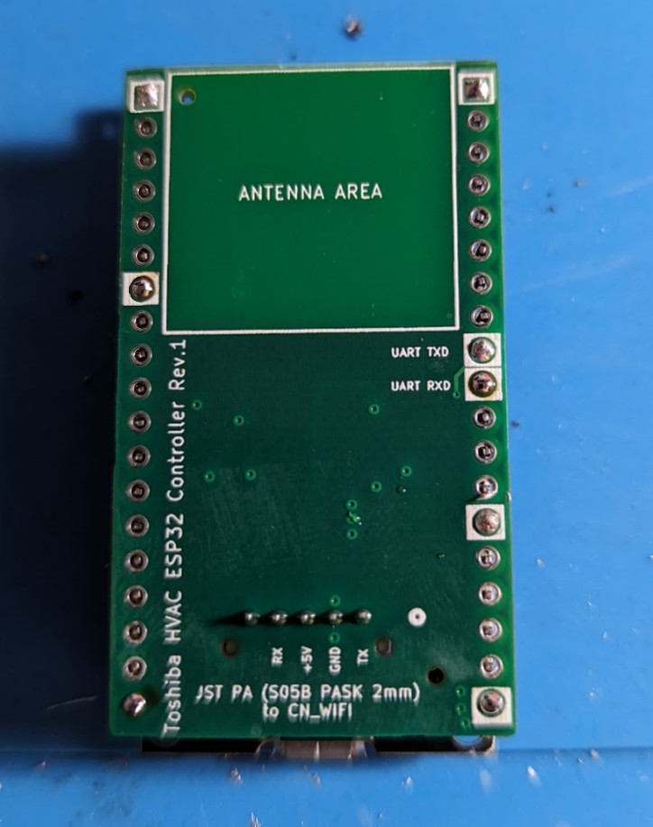
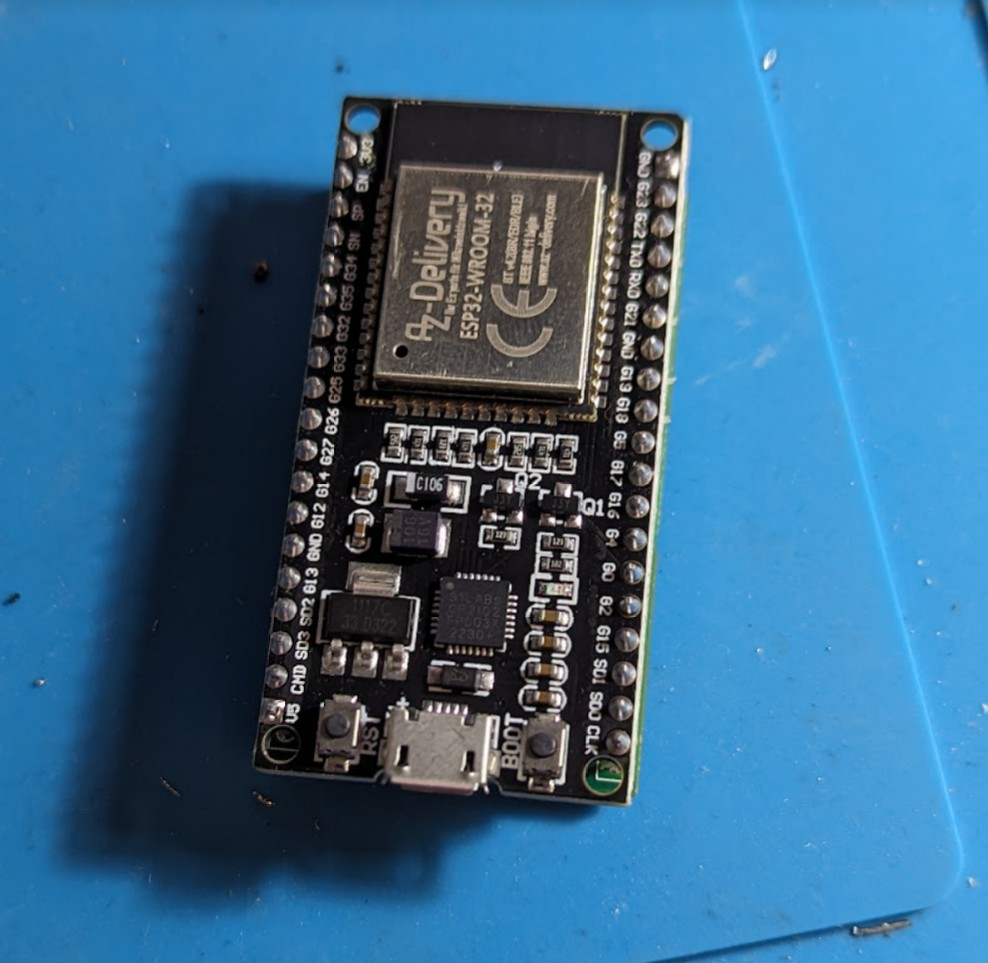
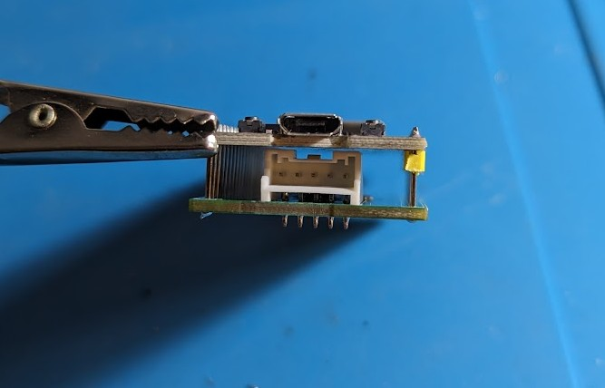
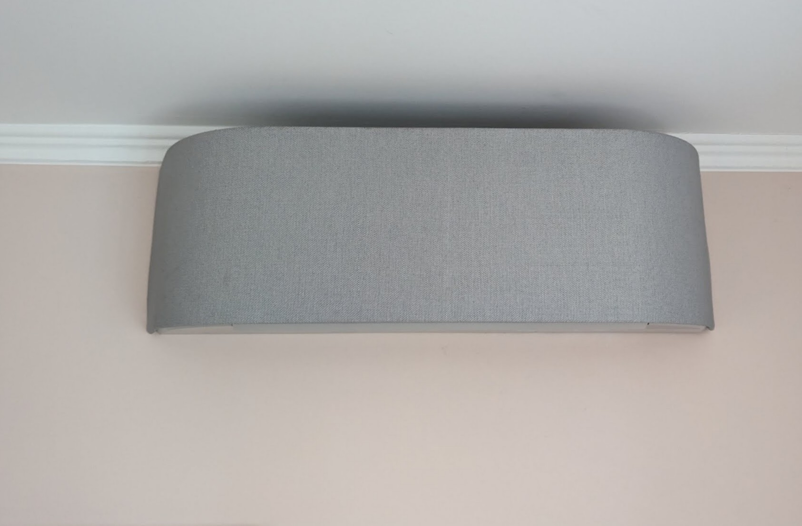
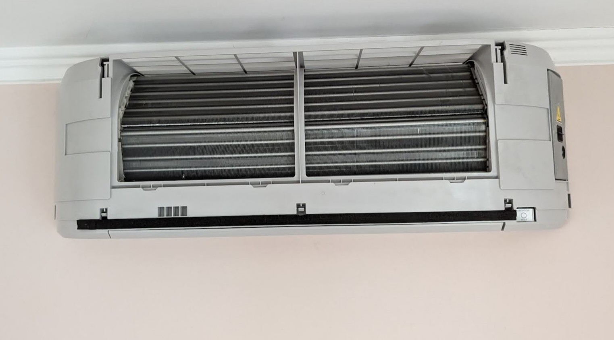
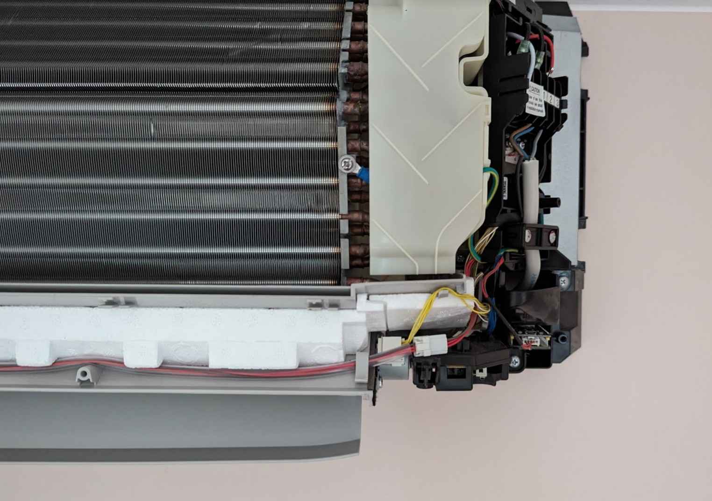
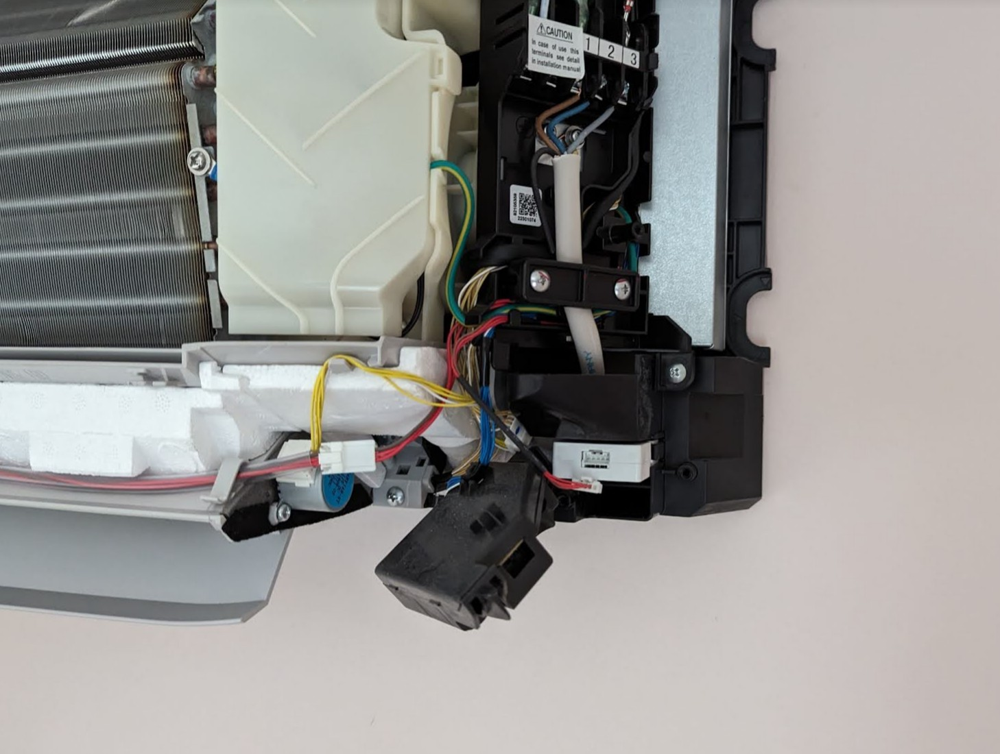
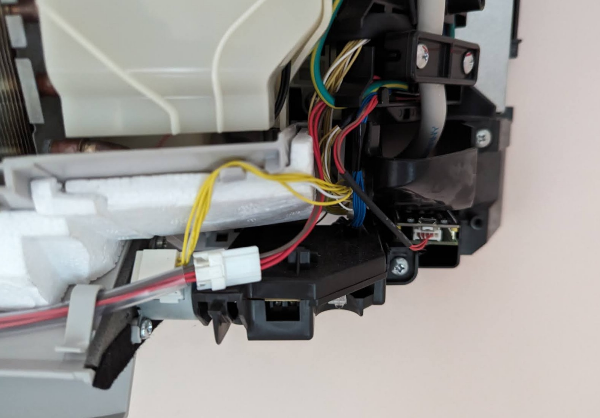

# ESPHome Toshiba / Carrier HVAC Controller over UART / WIFI Interface
This repository contains both the hardware (kicad & production files) for an ESP32 module as well as an [ESPHome](https://esphome.io/) component to control Toshiba / Carrier RAS HVAC units independently from the Toshiba Cloud.

ESP8266 is also supported but requires custom wiring.

The device can be used as a local, low cost drop in replacement to control the AC from [Home Assistant](https://www.home-assistant.io/) or others.

Features of the component:
* All operation modes & fan modes supported
* Does not depend on external vendor cloud services
* External temperature sensor support for accurate temperature regulation (external sensor entity configurable)
* Wired and IR remotes still work, even with external temperature sensor
* Supports most special modes / merit modes like silent, fireplace, extended heating temperature range
* Support for power modes on single split units and ionizer toggle
* Additional information like fan speeds, compressor load, refrigerant / pipe temperatures

Missing functionality:
* WIFI led toggle (always on after controller handshake)
* Manual defrost (probably unsupported over UART WIFI interface)
* ODU error messages (not decoded yet)
* Timer / schedules (had no interest in this functionality)
* Capability detection (all fan & merit modes will be shown, but not all might have an effect depending on the IDU)

Requirements:
* Toshiba/Carrier RAS single- or multisplit unit with built-in WIFI interface or WIFI module support (others might work as well, but untested)
* ESP32 DevKit 38 Pins (others like NodeMCU 8266 work as well but might require modifications)
* Toshiba HVAC module (see `hardware/` directory)
* ESPhome installed to flash the ESP32 initially

# UART Protocol
The IDU communicates over 5V `UART 9600E1`.
Messages include a length and a distinct header. Initial synchronization is ensured with a 200ms message timeout.

The protocol is relatively simple and can be observed in the `process_uart_rx` and `handle_message` functions, where the message type is identified by its length.
I've decoded most of the protocol by reading the communication with stock WRE-T00BJ10 modules and analyzing the messages against known responses from the Toshiba Cloud.

We can request registers from the IDU, we can write certain registers and also the IDU will send registers if updated externally (IDU / ODU status and changes via IR remote).

# Compatibility
Probably all Toshiba RAS units with wifi capabilities (built-in or with additional module) are supported.

The software has been tested with the following outdoor units:
* RAS-3M18U2AVG-E (Tripe-split)
* RAS-2M14U2AVG-E (Dual-split)
* RAS-25G2KVP-ND (Single-split)
And these indoor units:
* RAS-B10N4KVRG-E (Haori)
* RAS-25G2AVP-ND (Super DAISEIKAI 8)

Other units (with any compatible outdoor unit) that are almost certainly supported:
* Toshiba Seiya
* Toshiba Shorai
* Rebranded models like *Carrier X Inverter*

# Hardware

The hardware needs three main components:
1) **Microcontroller**. Any ESP32-DevKit with 38 Pins should work. ESP8266 is also supported, see "ESP8266" below.
2) **Bidirectional Voltage Level Translator**. This is needed to connect to the UART interface and shift between 5V from the AC to 3.3V of the ESP32. I used a `Texas Instruments TXS0108EPWR`.
3) **Connector** Toshiba uses as JST PASK connector for the WIFI modules cable, `JST S05B-PASK-2(LF)(SN)` is the correct connector. 

External voltage regulators are not required, as the UART inteface in the indoor units works at 5V and can be directly fed into the ESP32 DevKit.

The Kicad 7 project files and ready-to-use production files (for JLCPCB or PcbWay manufacturing) are available in `hardware/` and `hardware/production` respectively.

*Attention: The Haori units with built-in WIFI modules lack height for the 2x 19p 2.54mm pin sockets. I disabled placement for the pin sockets and soldered the ESP32 on the modules:* 

# Installation
This depends on the indoor unit.
The following photos from a Toshiba Haori show how the built-in module can be replaced in a few minutes:

# Firmware
There are multiple ways to build the firmware, flash it on the device, and add the controller in Home Assistant. A rough summary:
1. Clone this repository and navigate to the `esphome` directory.
2. Install ESPHome command line tools on Linux: https://esphome.io/guides/installing_esphome.html
3. Ensure the Python virtual environment is activated (`source venv/bin/activate`).
4. Copy `template.yaml` to (for example) `toshiba-livingroom.yaml` and edit the lines marked with `XXX`.
5. Connect the ESP32 module to your computer with a micro USB cable. This is only needed the first time, after that it can use OTA updates over wifi.
6. Run `esphome run toshiba-livingroom.yaml` to build the firmware and upload it to the device.
7. The device can now be added in Home Assistant (Settings => Devices & Services). HA will ask you for the encryption key from the YAML file.
 
If you just want to connect to the device to view the debug logs, use `esphome logs toshiba-livingroom.yaml`.

# ESP8266
To use a (NodeMCU) ESP8266 instead of an ESP32 DevKit, take the `template8266.yaml` as reference instead.
Also a bidirectional logic level converter  must be connected to `GPIO1 (TX)` and `GPIO3 (RX)`.

The NodeMCU can be powered directly from the indoor unit's UART connector 5V Pin 3 through VIN.

# FAQ
## Smart Thermostat / Internal Thermistor
If the binary switch `Internal Thermistor` is disabled in Home Assistant, the external temperature sensor supplied in the `yaml` configuration will be used for the room temperature.

Most ACs suffer from poor thermistor placement (high position, heat draft) and Toshiba does not support external thermistors over UART.

This requires a more complex regulation in the `smart_thermostat_control` function which can be fine tuned with the `smart_thermostat_multiplier` config parameter.

A recommended value is `4`, which results in a regulation accuracy of around `+/- 0.25°K`.
Higher values increase the accuracy at the cost of more compressor cycles.

## ODU parameters (`cduIac` & `cduLoad`)
The parameters `cduIac` and `cduLoad` seem off at first however, the values are identical to Toshiba's own parameters.

The `cduLoad` is internally called `cduCompHz` by Toshiba and has a range from 0-170.
Since the value has an identical range regardless of the compressor, does not match the actual compressor frequency and is independant for each indoor unit, I converted the number to a percentage which correlates well with the requested power for the IDU.

The same is true for `cduIac` which is closely following `cduLoad`.
My best guess is that `cduLoad` is the heat request for the IDU and `cduIac` is related to the IDU's EEV.

# Credits
* Inspiration & initial protocol description from [ToshibaCarrierHvac](https://github.com/ormsport/ToshibaCarrierHvac)
* ESPhome component structure from [esphome-lg-controller](https://github.com/JanM321/esphome-lg-controller)

# License

This project is released under the MIT License.
